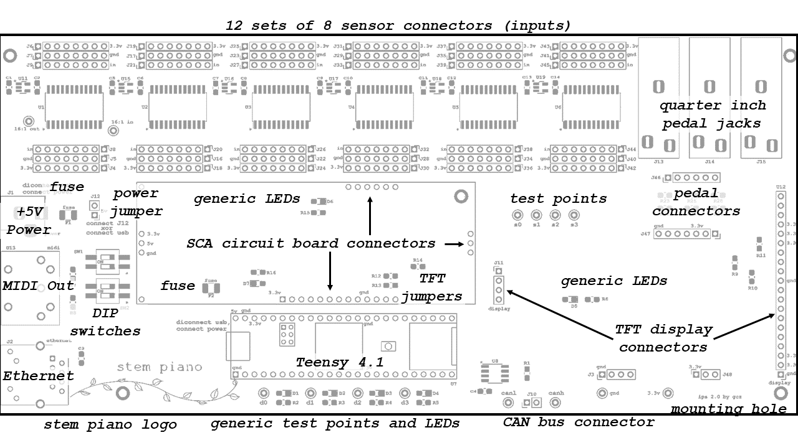

# Integrated Processing System 2 (IPS2) specification

The mainboard for hammer or damper sensor connections and Teensy 4.1 processing.

## Features

### I/O
* The board supports 96 sensor inputs.
  * Either:
    * Analog interfaces to 88 hammer sensor boards, or
    * Analog interfaces to 88 damper sensor boards.
  * 3 pedal inputs: 1/4 inch.
  * With less pedal inputs, it is also possible to use extra inputs for more than 88 piano keys.
  * With less piano key inputs, it is also possible to have more pedal inputs.
* MIDI output.
* Ethernet interface (optional).
* +5 volt, 1.75 amp power input. Current is when using with 88 HPS 0.4 or HPS 0.8 sensors. Current input could be different with alternate sensor.
* CAN bus.

### Capabilities
* Process hammer samples and generate MIDI outputs.
* Process damper samples and send to hammer processing board.
* Process pedal samples and generate MIDI outputs.
* Dual in-line package switches for configuration.
* Optional advanced monitoring, setup, and analytics over Ethernet and web brower.
* Optional hammer and pedal data over Ethernet using the piano network protocol (PNP).
* Optional TFT display for setup.

### Components
* Selected for availability.
* Relatively large pitch, relatively easy to solder parts.
* Requires a Six Channel Analog (SCA) card.
* The parts list(s) includes an index number in the file name to support differences depending on application. Files:
  * [./ips20_bill_of_materials_0.txt](./ips20_bill_of_materials_0.txt)

## Form
* 8.5 inches by 4.0 inches.
* Single board.

## Top Level PCB Description

### Sensor connectors
0.1 inch spaced connectors for connecting wires to the Hammer Position Sensor (HPS) boards. Does not require HPS boards. Can connect to any sensor system that meets input signal requirements.

### Quarter inch pedal jacks
For connecting pedals.

See discussion in issue: https://github.com/gzweigle/DIY-Grand-Digital-Piano/issues/74

### Pedal connectors
0.1 inch spaced connectors J46. Connect to six of the sensor connectors. See instructions in the *pianos/* directory for this board.

### +5V power

* Cut the 5V pad on Teensy 4.1 per instructions at PJRC website before installing the Teensy processor. https://www.pjrc.com/teensy/external_power.html

* See: https://github.com/stem-piano/stem-piano-top/blob/main/WARNINGS.md

### Fuse

Location for fuses. The +5V power and USB must must automatically protect from short circuits, overcurrent, thermal, and all other failure conditions

User to decide on PCB fuse design and strategy. See the bill of materials file(s) in this directory.

Here is a short video on the *stem piano* historical progress YouTube channel about removing and replacing a surface mount fuse. Also see other resources on the internet.
https://www.youtube.com/watch?v=TsNTWSIT84I

### Power jumper (J12)
Install only after 5V pad on Teensy 4.1 is cut per instructions at PJRC website.

https://www.pjrc.com/teensy/external_power.html

### MIDI Out
Five-pin MIDI output connection. The board does not have a MIDI input.

### Ethernet
Ethernet connection.

### DIP switches
For simple configuration settings. Programmable with the Teensy firmware. See code for functionality.

### SCA circuit board connectors
The analog-to-digital conversion (ADC) subsystem is on a separate, removable, card that connects to the IPS printed circuit board. This simplifies and reduces the cost of testing an ADC and enables experimenting with different hammer or damper ADC resolution and sampling rates. Also, ADC parts can often be in packages that are difficult to solder. A separate circuit board lowers the cost and impact of soldering mistakes.

Headers J3, J47, and J48 make it possible to increase the size of the SCA. This allows larger and more complex analog circuits. In this case, either do not use the TFT, or use longer connectors so the TFT is above the SCA.

### Generic test points and LEDs
Programmable test points and LEDs through the Teensy firmware.

### Teensy 4.1
What makes everything possible.

### TFT jumpers
Zero-ohm resistors R12, R13, and R14. Only needed if TFT display is connected.

### CAN bus connector
Connect two wires between hammer and damper circuit boards. If not using a damper circuit board then leave these disconnected. Connect each wire to the same location on the other board (left side of connection to left side, right side to right side).

### TFT display connectors
Connection for optional 2.8-inch display.

### stem piano logo
Yeah!!

## Power Supplies and Connections

[ips20_power.md](./ips20_power.md)

## Design
Location of timing analysis: [../../../design/data_acquisition/eca0X_ips2X/eca0X_ips2X_timing_design.md](../../../design/data_acquisition/eca0X_ips2X/eca0X_ips2X_timing_design.md).
